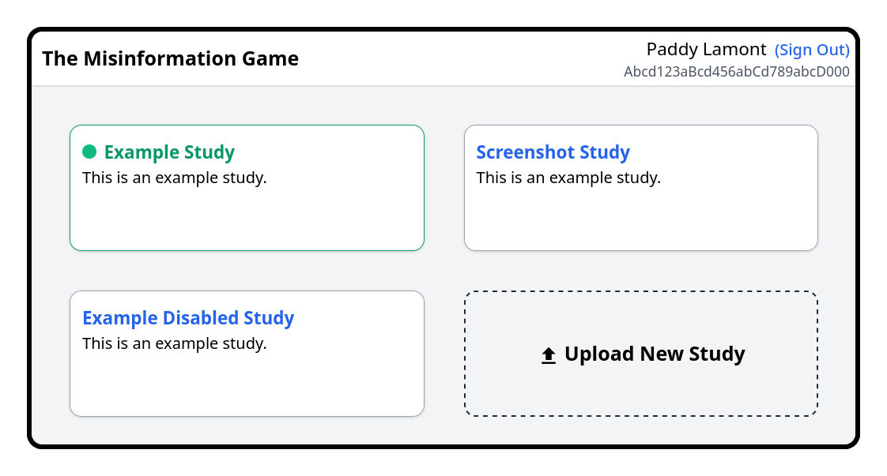
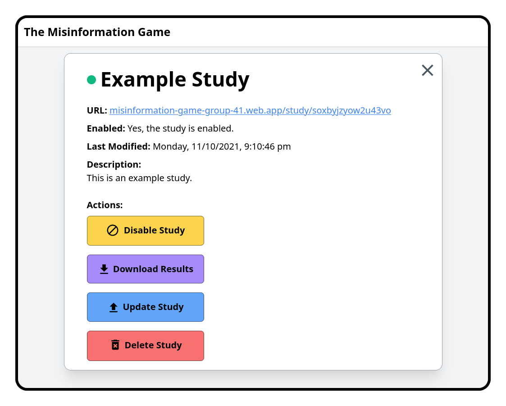

------------------------------------------------------

The Misinformation Game is a social-media simulator built to study
how people interact with information on social-media. To achieve
this, The Misinformation Game simulates a social-media feed for
research participants. Participants are shown fake social-media
posts, either one at a time or in a feed format. They may then
react to the posts and their comments. The Misinformation Game has
been designed to be highly customisable so that a range of tightly
controlled experiences can be created for participants. This
customisability is a core focus of The Misinformation Game, to
facilitate the research of a wide array of social-media related
questions.

**Preprint Paper:** [The (Mis)Information Game: A Social Media Simulator](https://psyarxiv.com/628wc/)

**Documentation:** [MisinfoGame.com](https://misinfogame.com)


# Example Game
If you would like to try a study created using
The Misinformation Game, you can access an example game from
[here](https://misinfogame.com/link/ExampleGame).
You may enter any ID to access the example game.


# Features

- Social media simulator with posts that may be displayed
  in a feed, or one at a time.
- Participants may react to posts, or comment on them.
- Dynamically updating follower numbers and credibility scores
  based on participants' interactions with posts.
- Several options for the dynamic selection of sources and posts
  to show to participants.
- Customisable engagement metric information.
- Configurable prompt to be shown to participants before they
  begin participating in a study.
- Configurable introduction, game rules, and debriefing screens to be shown
  to participants before and after they complete a study.
- Ability to generate unique completion codes for participants.
- Rich recording of participants' interactions to allow analysis of their behavior.
- Security to restrict access to the results of studies, and to
  stop unauthorised users from uploading their own studies.
- Ability to completely delete old studies and their results to
  ensure privacy of participants is maintained.


# 🛠️ Documentation

Guides to creating studies using the Misinformation Game, information regarding its
functionality, and its system architecture can all be found in the documentation
for the Misinformation Game. This documentation can be accessed from
[MisinfoGame.com](https://misinfogame.com).


# 📖 Cite the Misinformation Game
```bibtex
@misc{butler_lamont_wan_prike_nasim_walker_fay_ecker_2022,
 title={The (Mis)Information Game: A Social Media Simulator},
 url={psyarxiv.com/628wc},
 DOI={10.31234/osf.io/628wc},
 publisher={PsyArXiv},
 author={Butler, Lucy and Lamont, Padraig and Wan, Dean L Y and Prike, Toby and Nasim, Mehwish and Walker, Bradley and Fay, Nicolas and Ecker, Ullrich K H},
 year={2022},
 month={Jul}
}
```


# 🖥️ Gallery

### Admin dashboard



### Admin study view



### Configurable prompt shown before starting a study


### Configurable debriefing shown after a study


# 📝 License
The Misinformation Game is licensed under the
[CC BY 4.0 License](LICENSE.txt).
