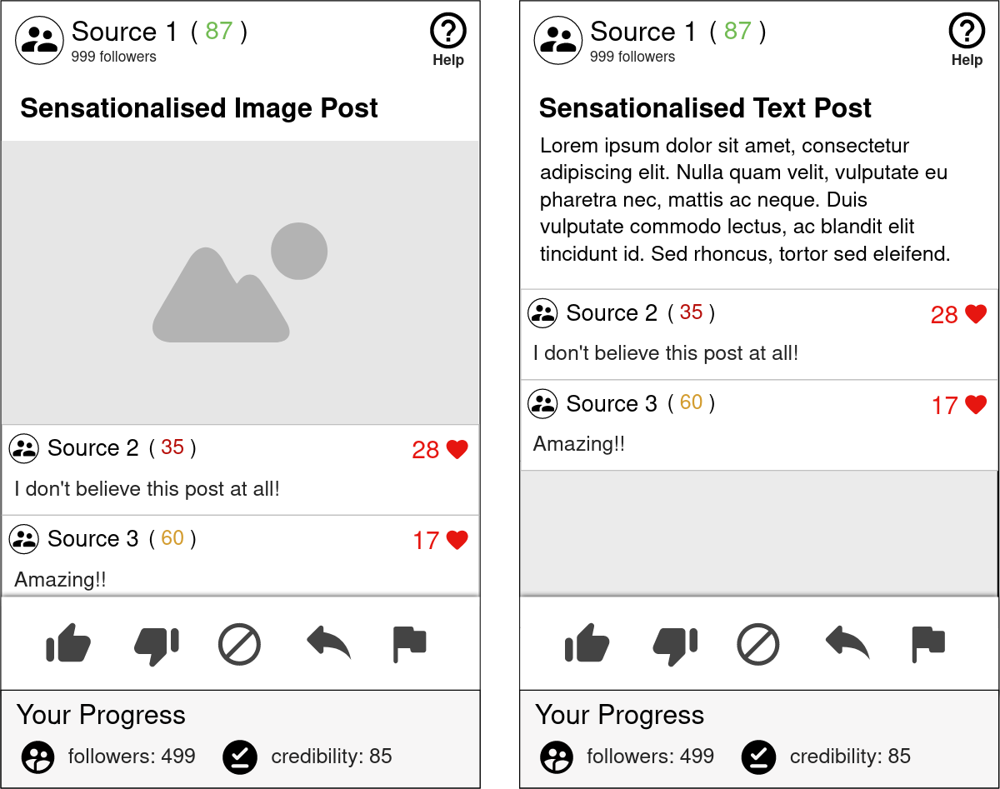

# The Game
The Misinformation Game is built as a web app so that it can be
accessed from desktop and mobile devices. Users will access a game URL
where they will be prompted with instructions for participating in a
social media simulation game. The game will show the users a mixture of
true and false social media posts, and the users will be prompted to
like, share, skip, dislike, or flag each post. Every interaction of the
user with these posts (except skipping) will influence their own
followers and credibility rating. For example, sharing true posts may
slowly grow the users followers and improve their credibility, whereas
sharing false posts may grow the users followers very quickly, but
reduce their credibility. The changes to user's followers and
credibility when they like, share, dislike, or flag each post can be
controlled by the researchers. Similarly, the sources of each social
media post will be randomised, and their followers and credibility
rating will also be changed throughout the experiment. 

Every game that is played by users is independent, and therefore users
interactions with the game will not affect one another. As users play
the game, their progress will be saved so that it can be later
downloaded as a CSV file by the researchers. This CSV file will
include the following information for every post that the user is
shown:
- The action that the user chose.
- The post that the user was shown, including its source, headline,
  text, and image.
- The current followers and credibility rating of the source.
- The current followers and credibility rating of the user before
  they interacted with the post.

The researchers will access these CSV files through an admin
interface. There will need to be a method of authenticating
researchers to restrict access to the admin page, and another
way to give new researchers access. The admin page will display a
list of all studies that have been uploaded to the system. The
researchers will then be able to open any study, which will take
them to a separate page where they can download the results
from participants in the study.

The admin page will also provide functionality for researchers to
upload new studies, and update existing studies.

# UI Design

The web app must be designed to be accessible from both desktop and
mobile devices, and therefore it should follow a responsive design.
A mockup of the game screen is shown below, however the mockup is
missing a way for users to access a help page for playing the game.

